# online-lib
Objective: online library projrct. 

users of system: there are two users of system     
	      1) Admin.    
	      2) user.
                  
 Functional requiremments of user:
1) User needs to sign-up in the sytem first.
2) Then he needs tp login using his email-id and password

Tools used :
1) Eclipse IDE.
2) Mysql for database.
3) Tomcat server.

How Projects work?

Project contains a navigation bar for admin and for new users .
If someone wants to issue a book he must register first on the portal and should remember his email and password.
Then he has to login again in the system to issue a book.
admin has a database where he can see who has issued a book followed by his name and email.

admin login code:
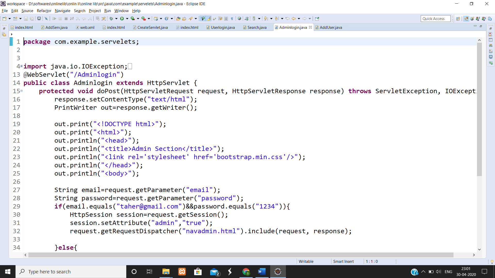

Add user code:
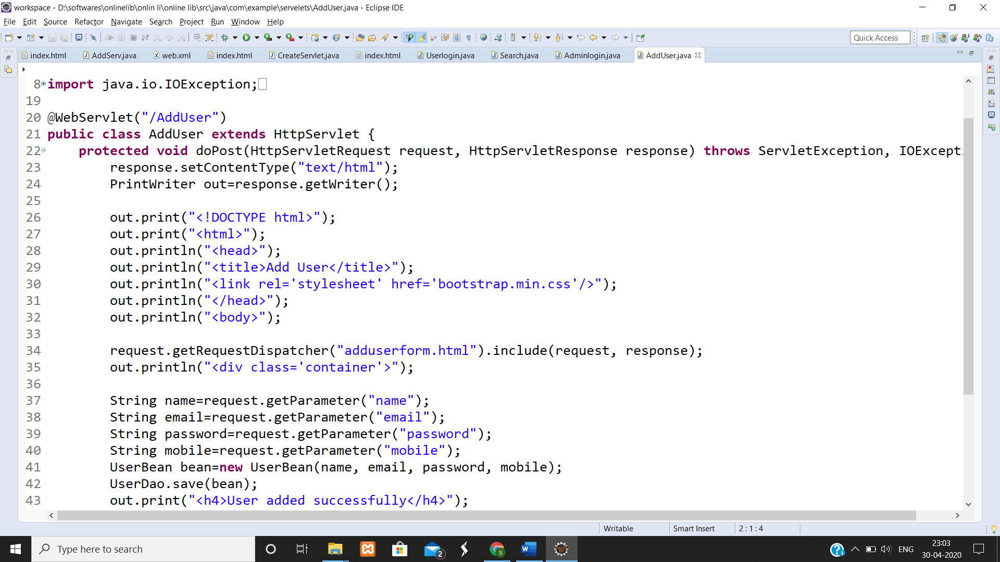

User login code: 
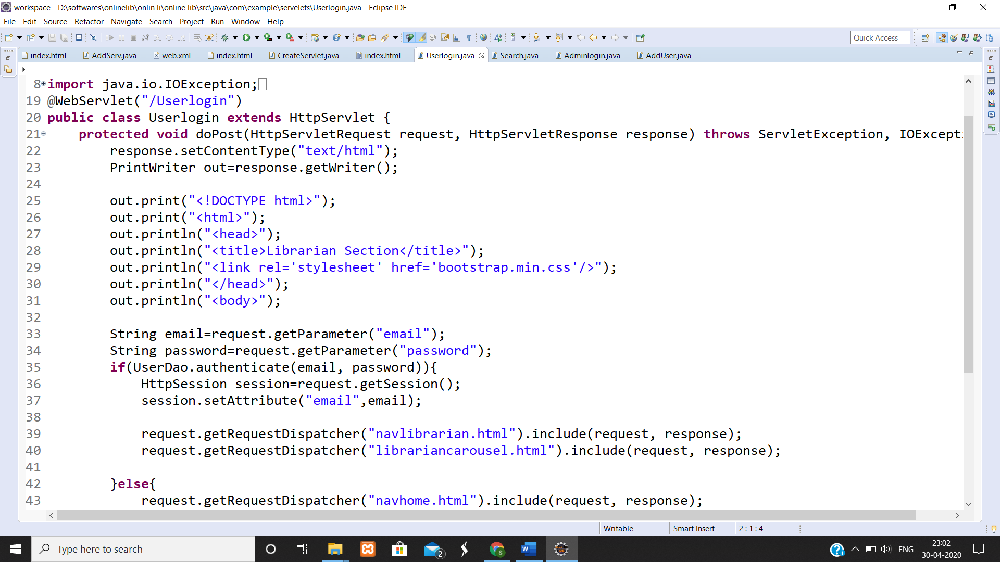

database images:
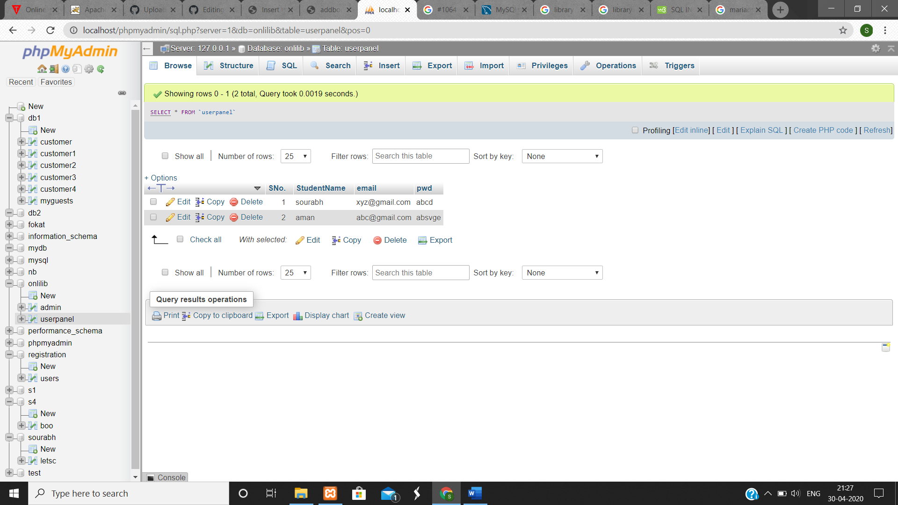

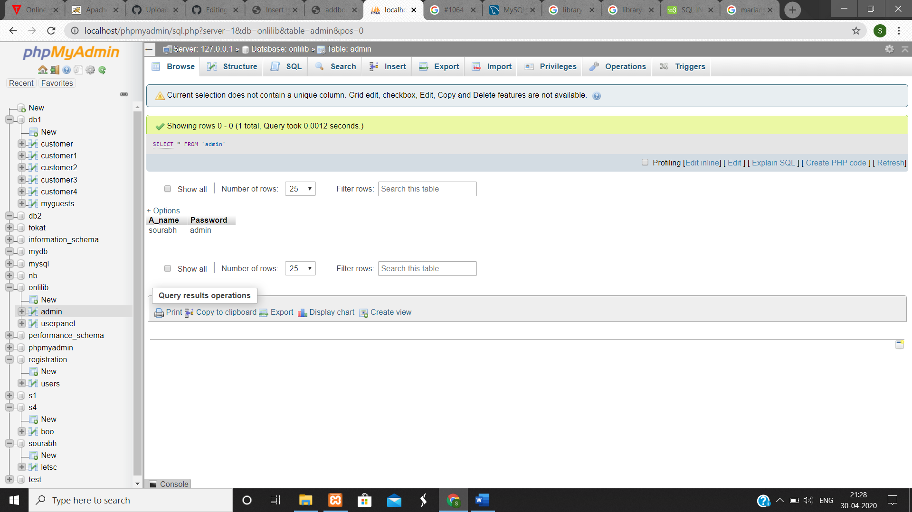

UI images:
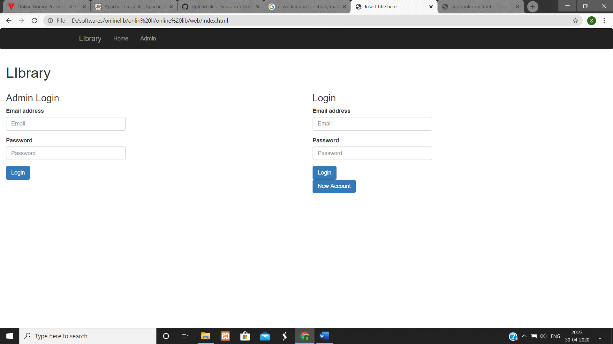

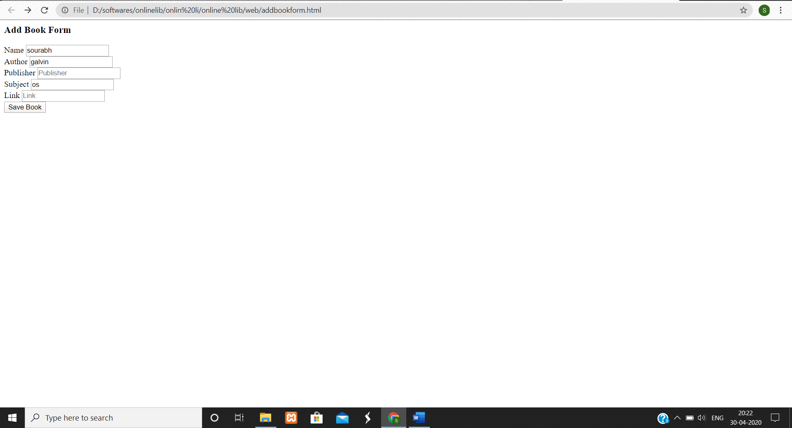

Class diagram:
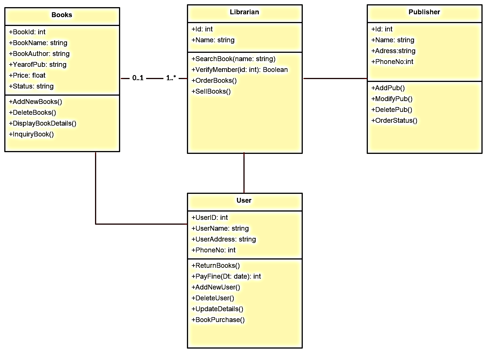

Dataflow diagram:
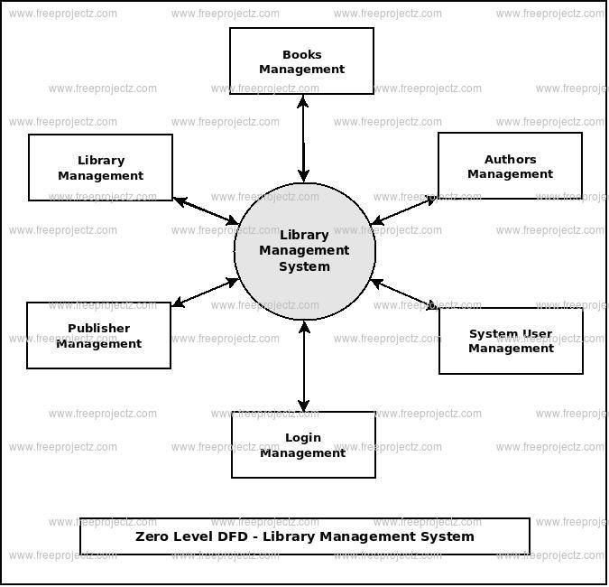

Activity digram:
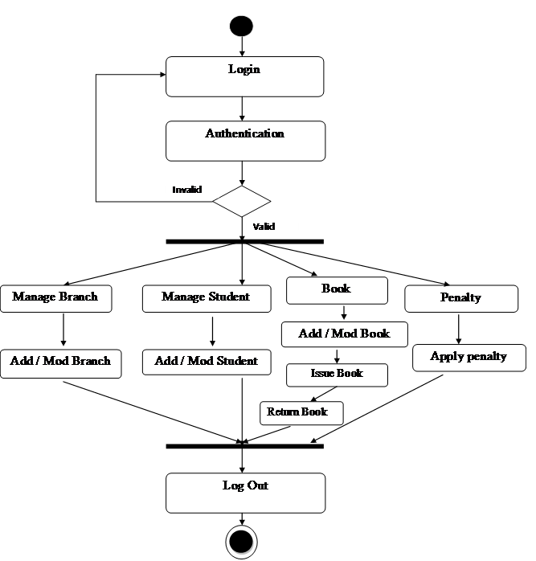

ER diagram:
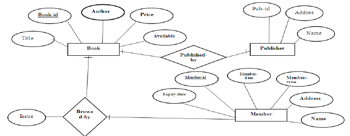

Sequential diagram:
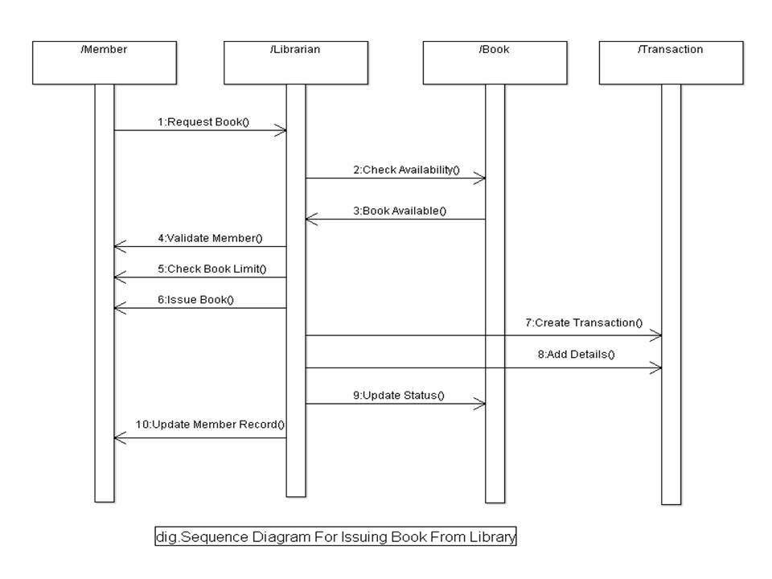

 
